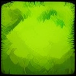
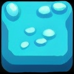
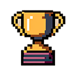

# Q-Learning: An Introduction

> Material accompanying the lecture series *NAIL133 – Agent-based Learning* at Charles University, Prague (2022+) 
by Dr. Adam Streck.

---

## Table of Contents

1. [What is a Policy?](#1-what-is-a-policy)
2. [The Bellman Equation](#2-the-bellman-equation)
3. [Solving the Bellman Equation Iteratively](#3-solving-the-bellman-equation-iteratively)
4. [Action Quality (Q-Values)](#4-action-quality-q-values)
5. [The Q-Table](#5-the-q-table)
6. [Exploration vs. Exploitation (ε-Greedy)](#6-exploration-vs-exploitation-ε-greedy)
7. [The Unity Implementation](#7-the-unity-implementation)
8. [The Broader RL Ecosystem](#8-the-broader-rl-ecosystem)

---

## 1. What is a Policy?

A **policy** `π` is a function that defines the behaviour of an agent. It maps states to a distribution over actions.

Given:
- A set of **states** `S`
- A set of **actions** `A`

A **deterministic policy** is a direct mapping:

```
π: S → A
```

A **stochastic policy** provides the probability of taking each action in a given state:

```
π: S × A → [0, 1]
```

### Grid World Example

In the example grid environment used throughout this repository:

- **Actions:** `A = {Left, Right, Up, Down}`
- **States:** `S = [0…7] × [0…4]` (an 8 × 5 tile grid)
- **Tile types:**<br>
   **Grass** — traversable tiles with reward `0`<br>
   **Water** — sink tiles with reward `−1` (no escape)<br>
   **Award** — goal tile with reward `+1`

The agent starts on a grass tile and can move in four directions. The episode ends when the agent reaches water or the award tile.


The map encoded as a 2D array of rewards looks like this:
```
_map = {
    { -1, -1, -1, -1, -1, -1, -1, -1 },   // all water border
    { -1,  0,  0,  0, -1,  0,  1, -1 },   // 1 = Award (trophy)
    { -1,  0,  0,  0, -1,  0,  0, -1 },
    { -1,  0,  0,  0,  0,  0,  0, -1 },
    { -1, -1, -1, -1, -1, -1, -1, -1 },   // all water border
}
```

There is a narrow choke-point at column 4, forcing the agent to navigate around it to reach the trophy.


The **optimal policy** leads the agent from any grass tile to the trophy in the fewest possible steps.

The problem of finding an optimal policy can be solved iteratively using the **Bellman Equation**.

---

## 2. The Bellman Equation

The **Bellman Equation** postulates that the long-term reward of an action equals the immediate reward for that action *plus* the expected reward from all future actions.

It can be computed iteratively for systems with:
- Discrete states
- Discrete state transitions via actions

### Formal Definition

Let:
- `s` — current state
- `a` — action taken
- `s'` — state reached by taking action `a` in state `s`
- `γ` — discounting factor (how much future rewards are worth today, `0 < γ ≤ 1`)
- `R(s, a)` — immediate reward for taking action `a` in state `s`

The **value** `V(s)` of a state is:

```
V(s) = max_a [ R(s, a) + γ · V(s') ]
```

This is the necessary condition for finding the **optimal policy** in dynamic programming.

---

## 3. Solving the Bellman Equation Iteratively

Computing the Bellman Equation is a **dynamic programming** problem. On each iteration `n`, we calculate the expected future reward reachable in `n+1` steps for all tiles.

### Problem Setup

```
a ∈ {Left, Right, Up, Down}
s = (x, y)

R(s, a) =  1   if s is the Award tile
           0   if s is a Grass tile
          -1   if s is a Water tile
```

A universal **sink state** is added: entering water or the award tile transitions the agent to the sink (episode ends). Therefore, we only allow taking an action when on a grass tile.

### Implementation in Unity — `Bellman.cs`

```csharp
private double GetNewValue(VTile tile)
{
    return Agent.Actions
        .Select(a => tileGrid.GetTargetTile(tile, a))
        .Select(t => t.Reward + gamma * t.Value)
        .Max();
}

private void CalculateValues()
{
    for (var y = 0; y < TileGrid.BOARD_HEIGHT; y++)
    {
        for (var x = 0; x < TileGrid.BOARD_WIDTH; x++)
        {
            var tile = tileGrid.GetTileByCoords<VTile>(x, y);
            if (tile.TileType == TileEnum.Grass)
            {
                tile.NextValue = GetNewValue(tile);
            }
        }
    }
}

```

On every step, the value `V(s)` of each tile is updated to the maximum over all actions of the immediate reward plus the discounted value of the resulting tile. The future reward **propagates outward from the Award tile** with a diminishing return controlled by `γ = 0.9`.

---

The solution converges after 10 iterations, at which point the optimal policy can be derived by selecting the action that leads to the tile with the highest value.


## 4. Action Quality (Q-Values)

The Bellman Equation tells us the *value* of a state. In Q-Learning we focus on the **quality of individual actions** the agent can take. Each `(state, action)` pair is assigned a **Q-value**.

When an action is taken, its Q-value is updated using a **temporal difference (TD)**:

```
Q(s, a) ← Q(s, a) + α · TD
```

Where the temporal difference is:

```
TD = R(s, a) + γ · max_a' Q(s', a') − Q(s, a)
```

| Symbol | Meaning |
|--------|---------|
| `α`    | Learning rate — how quickly new information overrides old |
| `γ`    | Discount factor — how much future rewards matter |
| `R(s, a)` | Immediate reward for taking action `a` in state `s` |
| `max_a' Q(s', a')` | Best Q-value available in the next state `s'` |

The TD term combines the **immediate reward** with the **best possible future reward**, making it a direct derivation of the Bellman Equation.


### Implementation in Unity — `QLearn.cs` (update step)

```csharp
var s = _agent.State;

// Update Q-values for ALL actions from current state
foreach (var a in Agent.Actions)
{
    var q      = s.GetQValue(a);
    var sPrime = tileGrid.GetTargetTile(s, a);
    var r      = sPrime.Reward;
    var qMax   = Agent.Actions.Select(sPrime.GetQValue).Max();
    var td     = r + gamma * qMax - q;
    s.SetQValue(a, q + alpha * td);
}

// Now pick action based on updated Q-values and move
var chosen = GetAction(s);
_agent.State = tileGrid.GetTargetTile(s, chosen);
```

On every step, the Q-values for **all four actions** from the current state are updated using the TD rule. Only after all updates are applied does the agent select and execute an action (via ε-greedy). This ensures the agent always acts on fully up-to-date Q-values.

---

## 5. The Q-Table

The **Q-table** is a data structure that stores a Q-value for every `(state, action)` pair. It is initialised to `0` and updated incrementally as the agent explores.

| (X, Y) | Left | Right | Up | Down |
|--------|------|-------|----|------|
| (0,1)  | 0.0  | 0.0   | 0.0| 0.0  |
| (1,1)  | 0.0  | 0.0   | 0.0| 0.0  |
| ...    | ...  | ...   | ...| ...  |

- **Rows** = states
- **Columns** = actions

After enough experience, the table converges so that `argmax_a Q(s, a)` gives the optimal action in every state.

### Implementation in Unity — `QTile.cs`

```csharp
public class QTile : BaseTile
{
    private readonly double[] _qValues = new double[4]; // one per action

    public void SetQValue(ActionEnum action, double value)
    {
        var index = (int)action;
        _qValues[index] = value;
        qValueTexts[index].text = value.ToString("F3");
        qValueTexts[index].color = TextColor(value); // green = positive, red = negative
    }

    public double GetQValue(ActionEnum action)
        => _qValues[(int)action];
}
```

Each tile in the grid *is* a row of the Q-table. The four Q-values are displayed directly on the tile and colour-coded (green for positive, red for negative).


---

## 6. Exploration vs. Exploitation (ε-Greedy)

A key challenge in Q-Learning is the **exploration–exploitation trade-off**:

- **Exploit** — pick the action with the highest known Q-value (greedy).
- **Explore** — pick a random action to discover potentially better paths.

### ε-Greedy Policy

Given a random value `r ∈ [0, 1]` and parameter `ε`:

```
if r > ε  →  exploit: select a = argmax_a Q(s, a)
else      →  explore: select a at random
```

### Decaying Epsilon

We typically want to **explore more early on** and **exploit more later**. This is achieved by decaying `ε` over time:

```
ε' = max(ε_min, ε − ε_decay)
```

| Parameter | Role |
|-----------|------|
| `ε_start` | Initial exploration rate (e.g., `1.0` — fully random) |
| `ε_min`   | Minimum exploration rate (e.g., `0.05`) |
| `ε_decay` | How much `ε` decreases per step (e.g., `0.001`) |

After enough steps, the agent's policy converges to always selecting the maximum-quality action.

### Implementation in Unity — `QLearn.cs` (action selection)

```csharp
private ActionEnum GetAction(QTile state)
    => Random.Range(0f, 1f) > _epsilon
        ? Agent.Actions.Shuffle().OrderBy(state.GetQValue).Last()  // exploit
        : Agent.RndAction();                                         // explore
```

The `Shuffle()` before `OrderBy` breaks ties randomly when multiple actions share the same Q-value.

Without ε-greedy (pure exploitation from the start), the agent quickly falls into suboptimal paths:


With ε-greedy exploration and decay, the Q-values converge to the optimal policy:


Epsilon is decayed after every step:

```csharp
_epsilon = Mathf.Max(epsilonEnd, _epsilon - epsilonDecay);
```

---

## 7. The Unity Implementation

The simulation is built in Unity and consists of the following components:

### Grid & Tile System

| Class | Purpose |
|-------|---------|
| `TileEnum` | Enum for tile types: `Water = -1`, `Grass = 0`, `Award = 1` |
| `ActionEnum` | Enum for actions: `Left = 0`, `Right = 1`, `Up = 2`, `Down = 3` |
| `TilePos` | Lightweight record storing `(X, Y)` grid coordinates |
| `BaseTile` | Base MonoBehaviour for all tiles; holds `Reward` and `CurrentPos` |
| `VTile` | Extends `BaseTile`; displays a single state value `V(s)` (used by Bellman demo) |
| `QTile` | Extends `BaseTile`; stores and displays four Q-values (used by Q-Learning demo) |
| `TileGrid` | Manages the 8 × 5 grid; handles tile generation, coordinate lookup, and movement rules |


### Movement Rules — `TileGrid.cs`

```csharp
// Bounded move on grass; otherwise stay
private TilePos GetTargetPos(TilePos source, ActionEnum action)
{
    var tile = _tiles[source.Y, source.X];
    if (tile.TileType == TileEnum.Grass)
    {
        return action switch
        {
            ActionEnum.Up    when source.Y > 0                  => source with { Y = source.Y - 1 },
            ActionEnum.Down  when source.Y < BOARD_HEIGHT - 1   => source with { Y = source.Y + 1 },
            ActionEnum.Left  when source.X > 0                  => source with { X = source.X - 1 },
            ActionEnum.Right when source.X < BOARD_WIDTH - 1    => source with { X = source.X + 1 },
            _                                                    => source
        };
    }
    return source;
}
```

Movement is only possible from **grass** tiles. Attempting to move into water or off-grid keeps the agent in place. When the agent reaches a non-grass tile (water or award), the episode ends and it is **reset to the starting position** `(2, 2)`.

### Learning Parameters (`QLearn.cs`)

| Parameter | Default | Meaning |
|-----------|---------|---------|
| `alpha` | `0.1` | Learning rate |
| `epsilonStart` | `1.0` | Initial exploration rate |
| `epsilonEnd` | `0.05` | Minimum exploration rate |
| `epsilonDecay` | `0.001` | Epsilon decrease per step |
| `gamma` | `0.9` | Discount factor |

After ~100,000 steps with these defaults, the agent reliably navigates from start to the trophy.

---

## 8. The Broader RL Ecosystem

Q-Learning is one algorithm within a larger family of **Reinforcement Learning (RL)** methods. Algorithms can be categorised along several axes:

| Dimension | Options |
|-----------|---------|
| **State space** | Discrete (e.g., board games) · Continuous (e.g., FPS games) |
| **Action space** | Discrete (e.g., strategy games) · Continuous (e.g., driving) |
| **Policy type** | Off-policy (Q-Learning: `a'` is always maximised) · On-policy (SARSA: `a'` is selected by the agent's current policy) |
| **Operator** | Q-value · Advantage `A(s, a) = Q(s, a) − V(s)` |

Q-Learning is an **off-policy, discrete-action** method. Extending it to continuous state/action spaces leads to methods like **Deep Q-Networks (DQN)**, which replace the Q-table with a neural network.

In the grid world example, the Q-table has `|S| × |A| = 40 × 4 = 160` entries — perfectly manageable. But for a game like chess, the state space exceeds `10⁴⁴` positions, making an explicit table impossible to store or fill. A neural network **compresses** this vast mapping into a fixed set of learnable parameters (weights). Instead of storing one value per `(s, a)` pair, the network takes the state as input and outputs Q-values for all actions, generalising across similar states it has never seen before.


> For a comprehensive list of RL algorithms, see the [Reinforcement Learning Wikipedia page](https://en.wikipedia.org/wiki/Reinforcement_learning). Additional methods such as behavioural cloning are not listed there but are also used in practice. Real-world solutions typically use extended variants or combinations of the above.

---

## Summary

| Concept | Key Formula |
|---------|-------------|
| Bellman value update | `V(s) = max_a [R(s,a) + γ·V(s')]` |
| Q-value update | `Q(s,a) ← Q(s,a) + α·(R + γ·max_a' Q(s',a') − Q(s,a))` |
| ε-greedy action | `exploit if rand > ε, else explore` |
| Epsilon decay | `ε' = max(ε_min, ε − ε_decay)` |

Q-Learning is a **model-free**, **off-policy** reinforcement learning algorithm that learns the optimal action-selection policy by iteratively updating a Q-table through direct interaction with the environment — no prior knowledge of the environment's dynamics is required.
